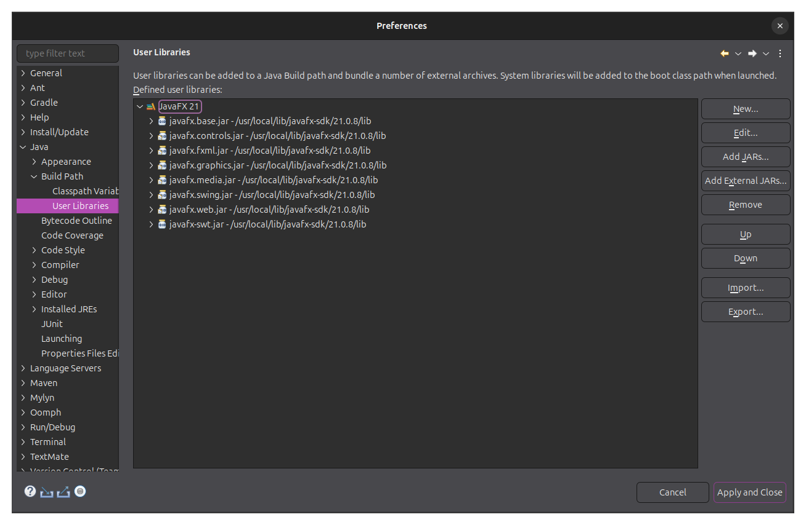
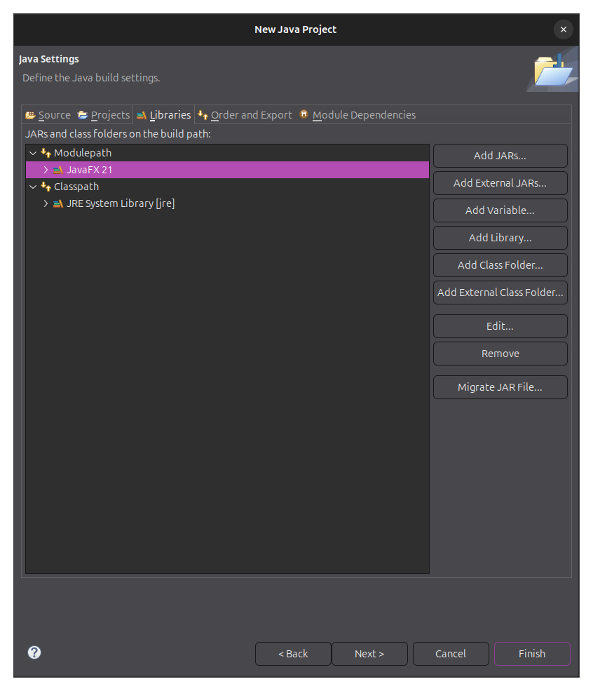

# Compilation Guide with Eclipse

The bare requirements for compiling and running Super Mario Paint are a **Java Development Kit (JDK)** and the **JavaFX** library. For contributing to the project, you will also need **Git**.

Using a development environment (IDE) is recommended. This guide will describe steps to compile the program with the **Eclipse IDE**. You can download the latest version from the [official website](https://eclipseide.org/). Eclipse comes with a pre-installed JDK---you may use that one, or install a different version from [Oracle's website](https://www.oracle.com/java/technologies/downloads/) if you wish. Eclipse also supports Git integration through a plugin. As for JavaFX, there are distributions available on [Gluon's website](https://gluonhq.com/products/javafx/).

We recommend you get matching versions of the JDK and JavaFX to ensure their compatibility. For example, you may pair JDK 21 with JavaFX 21. The absolute minimum requirement for Super Mario Paint is version 11, but version 21 or higher is recommended.

## Registering JavaFX

This step will make it more convenient to link the project with your version of JavaFX. Open Eclipse and go to `Window > Preferences` to open up the preferences menu. Then open tabs `Java > Build Path > User Libraries`. From here, you can declare and edit user libraries.

Click on `New` to declare a library. You can choose an appropriate name for your installation---this guide will use the name "JavaFX 21" for examples. When the library is defined, you can add modules to it by clicking on `Adding External JARs`. You will have to select every module from the location of JavaFX on your computer. Typically these will be under a `lib/` folder and have names like `javafx.base.jar`, `javafx.controls.jar`, etc.

Here is what the result should look like in the end: 

Optionnally, you can _add sources_ to each module, if they are included in your distribution of JavaFX. Doing so will allow you to inspect the JavaFX source code while working on the project. For each module, expand by clicking on the arrow, then double-click on `Source attachment: (None)`. In the window that opens, you need to select `External Location`, then `External Folder` and select the sources folder whose names matches the module (like "javafx.base" for the _base_ module). This must be done for every module with sources available.

## Project Setup

Get a copy of the [sources](https://github.com/DC37/Super-Mario-Paint) from Github. You can either clone it, or just download a ZIP if you don't wish to use Git. From Eclipse, go to `File > New > Java Project`. The window that opens will let you configure the project according to your preferences. You can fill in as in the following picture: 

- You can choose the project's name as you like;
- If "default location" is checked, you need to uncheck it and then browse to select the location of Super Mario Paint's sources on your computer;
- Please uncheck "Create module-info.java file" as the project is already configured with such a file;
- If you want to use a Java Runtime Environment (JRE) that's not the default one in Eclipse, you can select one from this window.

Click `Next`. The next window will give you the opportunity to link the project with JavaFX. Go to the `Libraries` tab. Click to highlight `Modulepath` and then click on `Add Library`. Follow the step to add the _user library_ you set up earlier ("JavaFX 21" in our case). The result should be this: 

When you click `Finish` the project should be set up! You can test by finding the file `src/gui/SuperMarioPaint.java` in the Package Explorer. Right-click on it and select `Run As > Java Application`.

### Troubleshooting

If you're having problems, the ideal way to contact us is through the Mario Paint Hangout. Before you do that, you can follow the steps in this section to try solving your problem.

You should first make sure the project is compiling correctly. A compilation error will manifest as a red cross symbol marking some files in the Package Explorer tab, and also lines in the Problems tab at the bottom of the screen.

A common source of issues is a missing JavaFX library. This will produce error messages about some classes that "cannot be resolved as a type". You can make sure JavaFX is linked properly by right-clicking on the project name in the Package Explorer, then go to `Build Path > Configure Build Path` and find the `Libraries` tab. Make sure JavaFX is present on the **modulepath** (not the classpath). You should also make sure the versions of JavaFX and the JRE match as not all versions are compatible with each other.

If the project is compiling, but running as described above does not work (Super Mario Paint never launches), then you can check if dependencies are correctly set for the JRE. The green button with a "play" arrow in the top panel can be used to run the program; click on the arrow next to it and go to `Run Configurations`. You can inspect the configuration for the launcher, in particular the `Dependencies` tab, which should also mention JavaFX on the modulepath, among other things like a JRE, and possibly the project "Super Mario Paint" itself.

